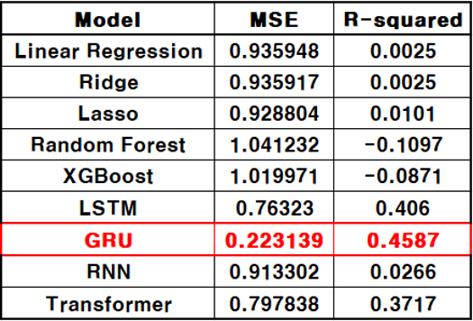

# 농작물 가격 예측 및 병충해 식별 모델

이 프로젝트는 **농작물 가격 예측 모델**과 **병충해 식별 모델**을 개발하여 농업 생산성을 높이고, 데이터 기반의 의사결정을 지원하는 것을 목표로 합니다. 주요 기술로는 기상 데이터와 과거 가격 데이터를 활용한 시계열 분석, 그리고 YOLO 기반 병충해 식별 기술을 포함합니다.

---

## 📄 주요 자료
- **최종 발표 자료**: [최종 발표 PPT](https://drive.google.com/file/d/1Jplnj-rCE6TP8o1Bhprr-4tosptDxM73/view?usp=sharing)  
  프로젝트의 목표와 결과를 요약한 발표 자료입니다.
- **최종 포스터**: [최종 프로젝트 포스터](https://drive.google.com/file/d/1t1NzNb2CeWvxvOGGWzqtYXfu4CZA52hz/view?usp=sharing)  
  프로젝트의 핵심 내용을 시각적으로 정리한 포스터입니다.
- **가격 예측 모델 데이터**: [모델 학습 데이터](https://drive.google.com/drive/folders/1k8HKGJQGYZwzEx3BNlIdrcIaGD6oL4LZ?usp=sharing)  
  농작물 가격 예측 모델의 학습과 테스트에 사용된 데이터입니다.

---

## 📹 시연 영상
[시연 영상 보기](https://drive.google.com/file/d/14VwTPOiGJ6_nfw1GynbdI7tAMBkR7qgV/view?usp=sharing)  
위 링크를 클릭하여 프로젝트 시연 영상을 확인하세요.

---

## 주요 내용

### 1. 농작물 가격 예측 모델
- **목표**: 기온, 강수량 데이터를 기반으로 농작물의 미래 가격을 예측.
- **사용 기술**:
  - GRU 모델: `gru_model.h5` (학습된 모델)
  - CNN-LSTM 모델: `CNN_LSTM_model.h5` (학습된 모델)
- **결과 시각화**:
  - 시각적 결과는 `예측성능결과.png` 파일에서 확인할 수 있습니다.
- **프론트엔드**:
  - GRU 모델용 웹 UI: `gru_model.html`
  - CNN-LSTM 모델용 웹 UI: `cnn_lstm_model.html`
- **백엔드 코드**:
  - GRU 모델: `app_gru.py`
  - CNN-LSTM 모델: `app_cnn_lstm.py`

---

### 2. 병충해 식별 모델
- **목표**: 작물에서 발생하는 병충해를 YOLOv7 모델을 통해 식별.
- **사용 기술**:
  - YOLOv7 기반 딥러닝 모델: `무_병충해_식별_YOLOv7_모델_.ipynb`
  - 프론트엔드 코드: `index.html`
- **데이터 파일**:
  - 병충해 식별 모델의 데이터는 YOLO 학습 데이터로 사용.
- **결과물**:
  - 병충해 탐지 모델은 정확한 객체 탐지 성능을 기반으로 병충해를 실시간으로 식별합니다.

---

### 3. 주요 결과

#### 농작물 가격 예측
- **모델 성능**:
  - **GRU 모델**:  
    - 평균 절대 오차 (MSE): 0.2231  
    - 결정계수 (R-Squared): 0.4587  
    - 이 모델은 **도소매업자용 모델**로 학습되었으며, 주로 기온과 강수량 데이터를 기반으로 가격 변동을 예측합니다.
  - **CNN-LSTM 모델**:   
    - 이 모델은 **소비자용 모델**로 별도로 학습되었으며, 소비자 가격 데이터 예측에 최적화되었습니다.

- **결과 시각화**:
  

---

### 4. 사용법

#### 농작물 가격 예측 모델
1. **데이터 준비**:
   - `finaldata_1.csv` 파일을 로컬 환경에 다운로드합니다.
2. **모델 실행**:
   - Colab 또는 로컬 환경에서 `프론트엔드_최종모델(도소매업자_전용_가격예모델).ipynb`를 실행하여 결과를 확인합니다.
3. **웹 인터페이스 실행**:
   - GRU 모델: `gru_model.html`과 연동된 `app_gru.py` 실행.
   - CNN-LSTM 모델: `cnn_lstm_model.html`과 연동된 `app_cnn_lstm.py` 실행.

#### 병충해 식별 모델
1. **모델 학습 및 실행**:
   - `무_병충해_식별_YOLOv7_모델_.ipynb`를 실행하여 YOLOv7 모델 학습 및 결과 확인.
2. **프론트엔드 테스트**:
   - `index.html` 파일을 로컬 서버 또는 VS Code 환경에서 실행.

---
